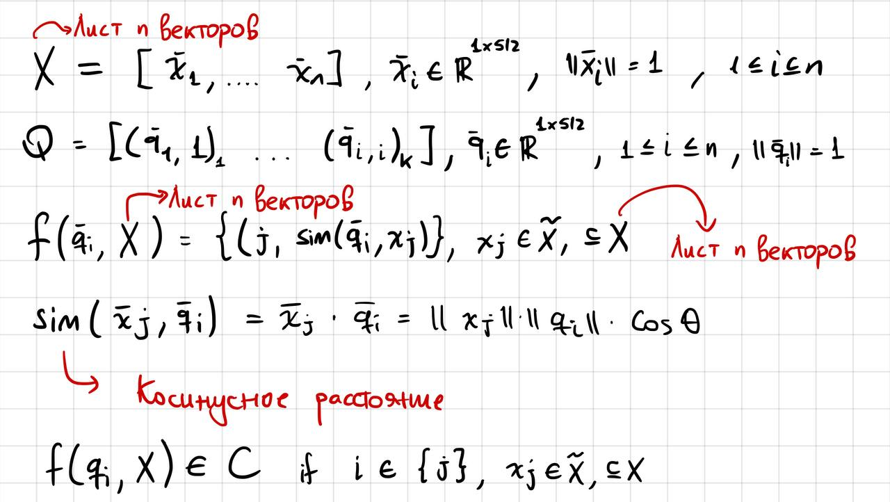

### Как участникам использовать OVISOIN_TOKEN?

- Участник создает репозиторий на основе данного, и делает его видимость private, чтобы никто не украл его код.
- https://github.com/FaceChainTeam/Hackaton_Search_Base
- Заходим в настройки этого репозитория `Settings->Secrets->Actions` создаем ключ `New repository secret` с названием Name: `OVISOIN_TOKEN` Value: `Тот самый токен полученный от o.vision`
- Url с настройками
```
https://github.com/ВАШ_ЛОГИН/Hackaton_Search_Base/settings/secrets/actions
```
- После добавления токена, когда вы будете делать git push с вашими комитами, они автоматически будет отгружаться на https://hackathon.o.vision/protected/upload с помощью github actions https://github.com/FaceChainTeam/Hackaton_Search_Base/blob/main/.github/workflows/hackaton.yml
- Смотреть результат бенчмарка тут https://hackathon.o.vision
- Бенчмарк проходит за 6 минут, на этой машине

# Hackaton Search Base

-------


1. **Цель**


Цель задачи хакатона заключается в том чтобы придумать оптимальный алгоритм поиска векторных представлений человека в базе векторных представлений разных людей. Векторные представление - это вектор с размерностью 1х512, каждый элемент которого имеет тип float32. Базовый алгоритм поиска представлений выполняет поиск с сложностью O(n), где n является количеством векторных представлений людей в базе. Необходимо придумать алгоритм который ускорил бы асимптотику поиска

2. **Данные**


Участники хакатона получат данные в следующем виде. Дан лист X, который хранит в себе n векторный представлении людей, где n - это     число людей в базе, а размерность векторных признаков равна 1х512. Каждый вектор является уникальным. Индекс листа Х является  индексом человека, например, векторное представление с индексом 3 в листе X относится к человеку 3 из всех n людей. 

Так же, участники получат лист Q длины k, состоящий из запросов. Каждый запрос является кортежем и состоит из 2х элементов: векторного представления человека размерностью 1х512 и индекса человека. Векторные представления в листе запросов Q являются уникальными, но относятся к людям из листа Х.
    




3. **Формат решения**

Pешение должно быть оформлено в виде класса. Класс должен иметь несколько обязательных методов:

* __init__: должен считывать данные и инициализировать их 
* `self.search_imp(query):` должен производить поиск векторного представления query по базе X - `self.reg_matrix`, и возвращать результат поиска - все индексы человека допущенные к проверке по базе Х и их похожести с query.  
* `self.insert_imp(feature):` должен вставлять векторное представление нового человека - `feature` в имеющуюся базу данных X - `self.reg_matrix` c учетом сохранения асимптотики поиска.

4. **Метрики**

Среднее время обработки запроса на поиск при условии, что для 95% запросов ответ должен содержать индекс человека, на которого был отправлен запрос.


5. **Запуск**

* Все необходимые библиотеки для решения задачи можно установить с помошью команды `pip install requirements.txt`
* Запустить бейслайновое решение можно с помошью комaнды `python main.py`
* Замерить скорость функции(добавив @profile декоратор на фунцию скорость которой необходимо замерить) можно с помошью команды `kernprof -l -v main.py` 
